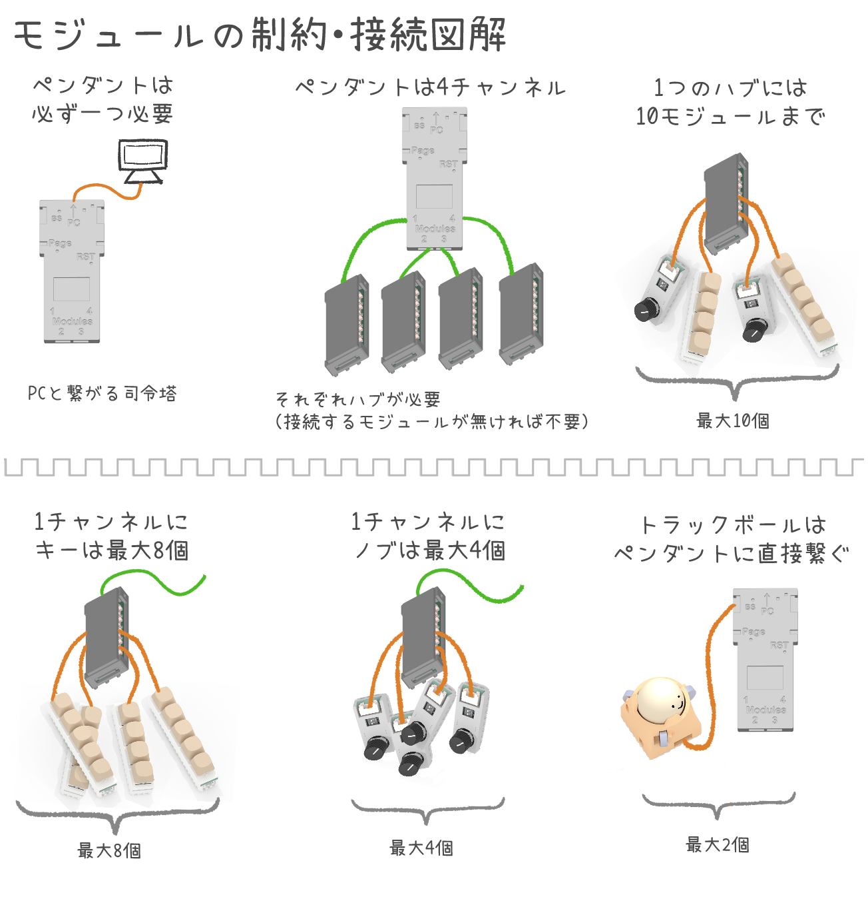
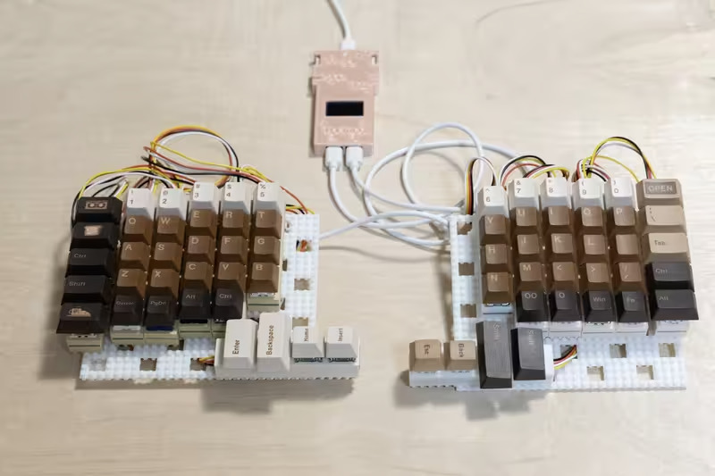
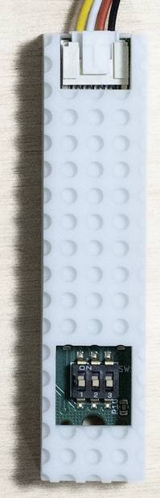
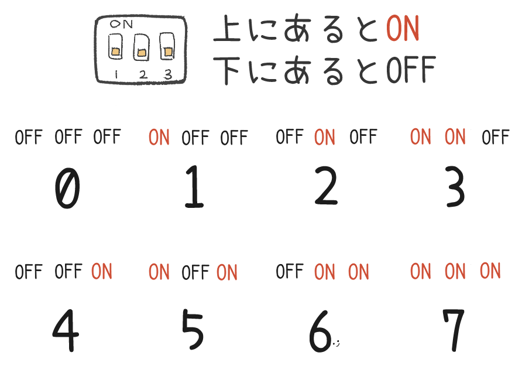

# ビルドガイド

このページは、[くっつきー](https://cue2keys.esplo.net/)のビルドガイドです。
ロードマップ・質問・要望等は[issue](https://github.com/esplo/cue2keys_resources/issues)をご確認ください。

## 概要

くっつきーは、フルモジュラー方式のキーボードです。
キー、トラックボール、ロータリーエンコーダーなどのモジュールを接続し、好きな機能を持ったキーボードを構成します。

詳細は[公式サイト](https://cue2keys.esplo.net/)をご覧ください。

## 用意するもの

- クリップなどの細いピン
  - スイッチを押すために使います
- Cherry MX互換のキーキャップ
  - 構成に合わせた数を用意します。キーモジュールが横向きになる場合、キースイッチとキーキャップの相性が問題ないか確認しましょう
- (あると嬉しい) パームレスト

## 組み立て手順

※: スターターセットなど構成済みセットを購入された方は、6から開始できます。

### 1. 作りたいキーボードを考える

[公式サイト](https://cue2keys.esplo.net/)の構成例などを見ながら、キーボードの構成を考えます。

### 2. 必要なモジュールを揃える / 購入ガイド

モジュールは[BOOTH](https://c2k.booth.pm)やイベントで販売しています。
考えた構成に必要なモジュールを揃えましょう。

ただし、モジュールごとに制限があります。
確認してから購入しましょう。
不明な場合は、[issue](https://github.com/esplo/cue2keys_resources/issues)や[SNS](https://linktr.ee/cue2keys)でお問い合わせください。

現時点での接続方式や制限を記載します。

- PCと接続するモジュールであるペンダントは、必ず一つ必要です
- ペンダントは4つのチャンネル（接続口）を持っています
- 使用する1チャンネルにつき1つハブが必要です。不要な場合は接続する必要はありません
- 4キーと5キーは、1チャンネルにつき合計で8つまで接続できます。8つ以上接続する場合は、他のチャンネルに分散する必要があります
- ロータリーエンコーダーは1チャンネルにつき4つまで接続できます
- トラックボールは特殊なモジュールです。最大2台接続で、ハブが不要です

スターターセットを例に取ってみてみましょう。

スターターキットは左右分割、66キーのキーボードです。
左手部分は5keyが5つ、4keyが2つで構成されており、ハブ経由でチャンネル1に繋がっています。
キーモジュールは合計で7つなので、上限の8個を超えていません。
右手も同様の構成で、こちらはチャンネル2に繋がっています。

### 3. 位置を考える

土台に仮置きして、モジュールの位置を決めます。
まだしっかりとは挿さず、すぐ抜けるようにしましょう。

キーの配置だけでなく、トラックボールやロータリーエンコーダーをどこに置くか、傾きをどうするかも決めます。
スターターセットでは、ハブは土台の下に置き、ハブと土台の間に10°チップを置くのが標準スタイルです。

なお、ロウスタッガードの場合は、キースイッチが横向きになるのでキーキャップがはまりにくい場合があります。キースイッチとキーキャップが対応しているか、事前にご確認ください。

位置が決まったら、モジュールの設定をします。

### 4. モジュールのアドレス設定

キーモジュール、ロータリーエンコーダーは、ディップスイッチでアドレスを指定する必要があります。
**キーマップの設定と連動**するため、スターターキットなどキーマップが決まっている場合は特定の設定にする必要があります。

同じモジュールは**チャンネル内で被らないよう**、ディップスイッチを設定しないといけません。
キーモジュールとロータリーエンコーダーは独立しているため、同じ設定でも構いません。
また、分かりやすさのため、左側に置くモジュールから0, 1, ...と設定するのが望ましいです

- キーモジュール
  - 3つのスイッチがあり、8通りの設定ができます
- ロータリーエンコーダー
  - 2つのスイッチがあり、4通りの設定ができます
  - 3つ目をケースで隠していますが、これは必ずOFFでないといけません。もしONになっている場合は、OFFに変更してください。

### 5. 接続する

設定できたら、ケーブルでモジュールの接続をします。
それぞれ異なるケーブル、接続先があるので、確認しつつ進めてください。

- キーモジュール・ロータリーエンコーダー
  - ハブと接続します。4本線のHYケーブルを使います。ハブは左右に5個ずつソケットがあるので、好きな場所に挿しましょう
  - もし、キーモジュールとロータリーエンコーダーの合計数が10を超える場合、1つのハブでは足りません。ハブを連鎖することもできますが、なるべく他のハブに繋ぎましょう
- トラックボール
  - ペンダントに直接接続します。6本線のZHケーブルを使います
  - 2つまで接続できます
- ハブ
  - ペンダントに接続します。USB A-Cのケーブルを使い、ペンダントの下部にある4つのチャンネルのどれかに接続します
  - どのチャンネルに接続するかで、キーマップとの対応も変わります。チャンネル1から使用するのがおすすめです
  - ケーブルの長さが1.5mで足りない場合は、延長することも可能です。ただし、あまりに長いと誤動作の原因となります

上手く接続できたら、最後にペンダントとPCを接続します。ケーブルはUSB C-A、C-Cのいずれも利用できます。長さが足りない場合は延長ケーブルを挟むこともできます。

なお、接続に必要な各種ケーブルはモジュール購入時に付属しています。
長さなどを変更したい場合は、モジュール詳細に記載のケーブル仕様を確認して、代替品を探してみてください。

### 6. 接続の確認

PCと接続してキーを押すと、ディスプレイに情報が表示されます。
もし表示されない場合は、正常なファームウェアが書き込まれていない可能性があります。
[ファームウェアガイド](./firmware_guide.md)を読み、書き込んでください。
上手くいかない場合は、接続先を確認したり、他のモジュールを外してから接続してみたり、FAQをご確認ください。

ディスプレイには、接続されているモジュールの種類が表示されます。

- `# Devices`: トラックボール以外の認識されているモジュール数
- `KEY4`: key4モジュールの認識されている数
- `KEY5`: key5モジュールの認識されている数
- `RE`: ロータリーエンコーダーモジュールの認識されている数
- `TB`: トラックボールモジュールの認識されている数

数が異なる場合は、チャンネル内で同じアドレスが設定されている可能性があります。
また、ケーブルがしっかりささっているか、ケーブル自体が破損していないかを確認してみてください。

### 7. キーマップの設定

無事接続できたら、キーマップを設定します。
[キーマップガイド](./keymap_guide.md)を見ながら進めてください。

### 8. 調整する

実際に使ってみて、位置やキーマップの調整をしましょう。
キーの位置が大きく変わる場合は、3から手順を繰り返してみましょう。
