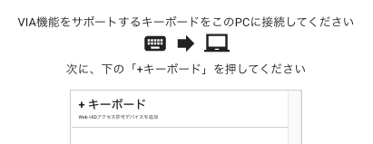
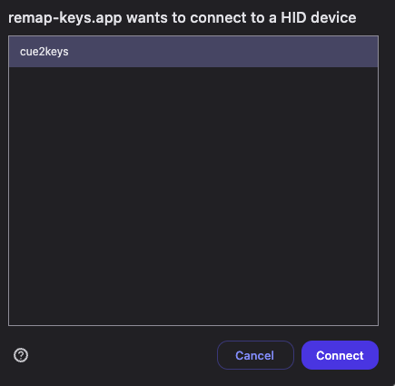
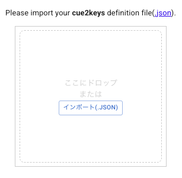
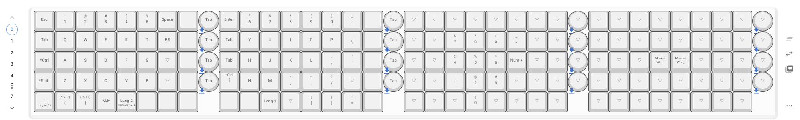
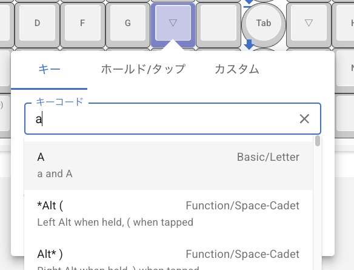
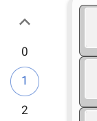
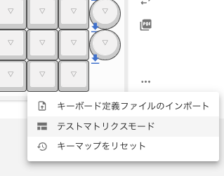
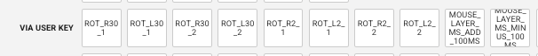

# キーマップガイド

キーマップは[VIA](https://caniusevia.com/)という仕組みに則っており、動的に変更ができます。
[REMAP](https://remap-keys.app/configure)などのツールは、ブラウザで好きなキーマップが簡単に指定できるためおすすめです。
このガイドでは、REMAPを使う方法を紹介します。

今後必要なキーマップの定義ファイルはこちらです。

[via.json](../firmware/via.json)

## REMAPを使う方法

### 準備

まずはブラウザで[REMAP](https://remap-keys.app/)を開きます。
`キーボードをカスタマイズ`ボタンがあるので、クリックします。

PCにキーボードが接続されていることを確認し、`+ キーボード`を押します。

ブラウザ上でこのような確認画面が出ます。
`cue2keys`を選んで`Connect`しましょう。

定義ファイルを尋ねられるので、[via.json](../firmware/via.json)をダウンロードして与えます。

少々読み込みに時間がかかることがあります。
読み込みが終わらない場合は、何度か試すとできることもあります。

すると、接続可能な全てのキーが表示された状態になりました。

キーのアイコンを押して変更したり、

レイヤーを変更してみたりしましょう。

### キーの確認

どのキーがどの位置に対応しているかは、テストマトリクスモードの機能で確認できます。
接続しているチャンネル、ディップスイッチの設定次第で位置が変わりますので、適宜確認してみましょう。

### カスタムキーコード

くっつきー独自のキーコードも設定することができます。
現在用意しているものは`FUNCTIONS`の`VIA USER KEY`にあり、キーを押すことで各種調整や機能変更ができるようになっています。
機能の詳細は[ファームウェアガイドのカスタムキーコード](./firmware_guide.md)をご確認ください。

なお、現在の設定値はディスプレイの2ページ目で確認できます。

- A1: ペンダントの左側に挿したトラックボールの角度
- A2: ペンダントの右側に挿したトラックボールの角度
- MD: トラックボールを止めてからマウスレイヤーが無効になるまでの時間
- MG: ポインターの移動速度倍率
    - 0 (0.5x)、1 (1.0x)、2 (2.0x)、3 (4.0x)

## キーマッピングの保存

REMAPには設定したキーマッピングを保存する、とても便利な機能があります。
ある程度固まったら保存するのがおすすめです。

## 備考

スターターキットの場合は、最初から一般的なキーマップが設定されています。好みに応じて変更しましょう。
