# くっつきー2 ビルドガイド

くっつきー2の世界へようこそ！

このドキュメントはくっつきー2のビルドガイドです。
購入ガイドはこちらをご覧ください。

## 概要

くっつきー2はフルモジュラー式のキーボードです。
各パーツはモジュールとしてケーブルで接続し、好きな数、位置に配置することができます。

特徴の詳細は、下記の記事をご覧ください。

https://www.esplo.net/ja/posts/2026/02/cue2keys2

下記のページにリンクをまとめています。

https://www.esplo.net/ja/products/cue2keys2

最新情報はSNSをご覧ください。

https://x.com/cue2keys

## V2で対応しているモジュール

- キーモジュール（最大4キー、メカニカルスイッチ）
- マグネキーモジュール（最大4キー、磁気スイッチ）
- ロータリーエンコーダー
- トラックボール
- ディスプレイ

### 接続用モジュール

- ハブ
- ペンダント
- 土台
- 土台ケース

### 初代の互換モジュール

初代くっつきーをお持ちの方は、初代の下記モジュールもつなぐことができます。

- 4キーモジュール
- 5キーモジュール
- 初代ロータリーエンコーダー
- 初代トラックボール

ただし、変換モジュールが必要です。
詳細は[初代ユーザー向けガイド](./first_user_guide.md)をご覧ください。

## 制約

接続できるモジュールの数や種類には、いくつか制約があります。
詳細は[制約ページ](./limits.md)に記載をしているので、必要になった際にご確認ください。

ご不明点はお気軽にご相談ください。

## ビルドガイド

### 準備

モジュールが揃ったら、組み立てと初期設定を行います。
ここからは[スターターセット DX](https://c2k.booth.pm/items/7753347)を購入したものとして進めます。

まずは付属品が揃っているかご確認ください。
スターターセット DXの場合は、下記の通りです。
他のセットの場合は、各商品ページをご覧ください。

- キーモジュール x14（赤いキースイッチが目印）
- マグネキーモジュール x1 （緑のキースイッチが目印）
- トラックボール x1
- ノブ x1
- ディスプレイ x1
- ハブ x2
- ペンダント x1
- 土台 x2
- 滑り止めシール x8粒
- 土台ケース x2

用意するものは次の通りです。

- キーキャップ
- (トラブルシューティング用) 細いマイナスドライバー
- 初期設定用の他キーボード（ラップトップPC）
- インターネット回線
- Chrome系Webブラウザー（現在Firefox/Safariでは動作しません。お手数ですが、Chrome系ブラウザをインストールしご利用ください）

うまくいかない箇所があれば、[トラブルシューティングガイド](./troubleshoot.md)を適宜参照ください。

### Step0: 理想の配置を考える

まずは理想の配置を考えましょう。
どのような物理レイアウトがいいのか、キーやトラックボールの位置はどのあたりが良いのかなど、利用シーンを思い描いて考えてみましょう。
一度決めたレイアウトも後から変更できます。

大体のイメージが固まったら、最終的にその形に変更すること考えつつ、一度保留します。

まずは動作確認のため、片手に7キーを持つカラムスタッガード配列で組み進めます。
無事動作確認ができたら、理想の配列や調整を試してみましょう。

### Step1: ペンダントの接続確認

まずは最低限の接続をして動作確認をしてみましょう。
PCとペンダントモジュールをUSBケーブルで接続します。

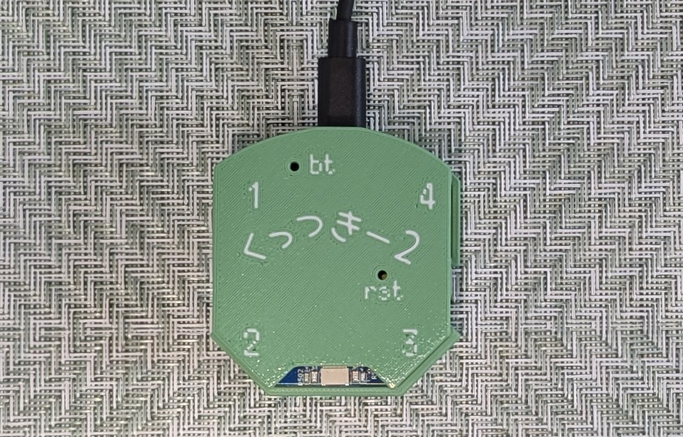

その後、Chromeブラウザー[^chrome]で下記のページにアクセスします。

[^chrome]: Chromiumベースのブラウザでも動作します。Chrome/Edge/Vivaldi/Braveなど。

https://app-cue2keys.esplo.net/

「接続」を押すと、次のようなダイアログが出てきます。
もし出てこない場合は、USBケーブルを差し直して少し待ってから再度確認してみてください。
また、接続する際に使うUSBポートも変更して試してみてください。

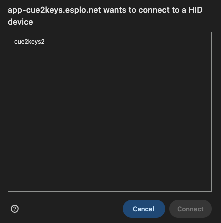

選択して接続をすると、次のような画面が出ます。

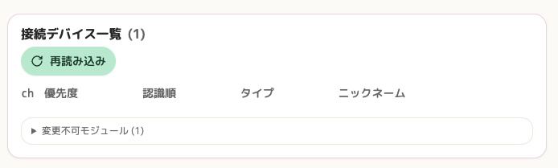

ペンダントのみを接続した状態では、他に接続されているモジュールがないため、このような表示になります。なお、内部的にペンダントに接続しているモジュールが`1`として表示されています。

このようにWebアプリから接続デバイスを確認できます。
この手順は以降繰り返し実施します。

#### ファームウェアの更新

ペンダントのファームウェアが最新でない場合には更新をしてください。
これは「その他」メニューで確認できます。

最新版のファームウェアがある場合はGithubへのリンクが表示されます。
`.uf2`ファイルがファームウェアの本体なので、これをダウンロードします。

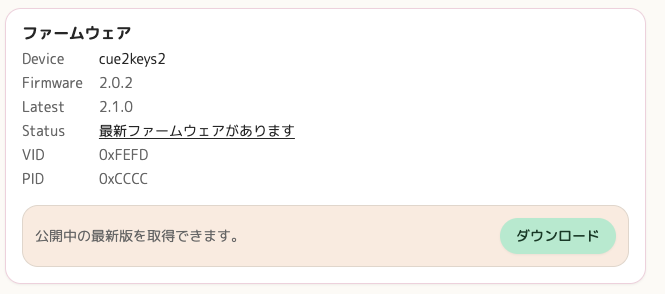

ペンダントの`rst`ボタンは、2回ゆっくりダブルクリックすると書き込み待ち状態になります。ケースはゆっくり左右に揺らしつつ上にスライドすると外せるので、外して押しても良いですし、ケースの穴から細いピンで押しても良いです。
書き込み待ちになると、`rst`ボタン付近のLEDが光ります。
もしうまく書き込み待ちにならない場合は、PCからケーブルを抜き、`bt`ボタンを押しながら接続してしばらく待ってみてください。

PCからストレージとして認識されるので、先ほどダウンロードしたUF2ファイルをドラッグ&ドロップします。しばらく待ってからPCからケーブルを抜き、接続し直してください。

書き込み後は先ほどの手順を繰り返し、動作に問題がないかを確認してください。

### Step2: モジュールの接続確認

次に、ハブモジュール経由でデバイスを接続し、デバイス一覧に出てくるかを確認します。

まずはPCとペンダントの接続を外します。
次に、ペンダントモジュールのチャンネル1にLANケーブルを繋ぎ、もう片方をハブに繋ぎます。

> [!TIP]
> PCと接続中にデバイスを抜いても、残りのデバイスで動作するようになっています。
> また、Webアプリのデバイス一覧から「再読み込み」を押すと、新しく接続されたデバイスを読み込むことができます。
>
> しかし、不安定な状態になることもあります。
> 可能ならPCから接続を外し、デバイスを接続した後繋ぎ直すのがおすすめです。

今回はディスプレイとマグキーが接続されていると仮定しています。チャンネル1の位置的に、左手側に配置したいものを接続するのがおすすめです。

チャンネル1に接続し、ペンダントをPCと繋ぎ、Webアプリから確認すると、次のように表示されます。
ここではハブにキーモジュールが7個、マグネキーモジュールが1個、ディスプレイが1個繋がっている想定です。
モジュールの順番は、現状気にしないで構いません。

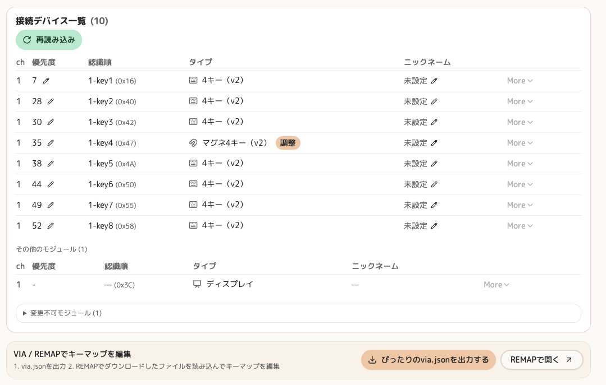

またディスプレイにも次のような表示が映ります（接続されているモジュールによって表示は変わります）。

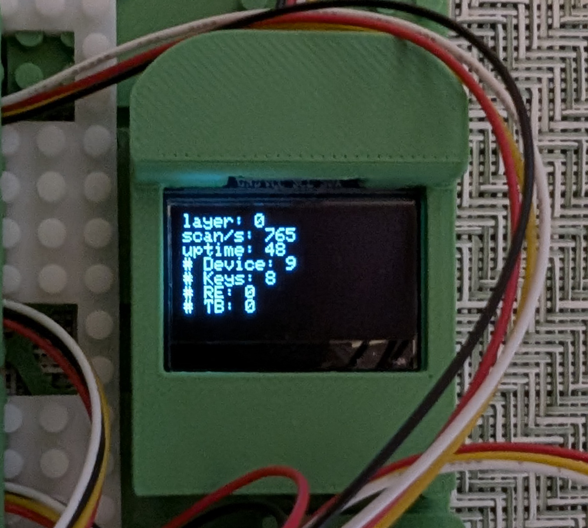

接続されている数と表示が合っていれば次に進んでください。
もし一部モジュールが認識されない場合は、[トラブルシューティングガイド](./troubleshoot.md)に進み、数が一致するまで確認をしてください。

チャンネル1で正常に確認できたら、チャンネル4にも接続をします。
位置的に、右手側に配置したいものを接続します。

トラックボールは、ハブの端にある6pinに接続できます。1つのハブには前後両面に1つずつ接続口がありますが、接続できるのは1つです。

スターターセット DXでは、最終的に次のような表示になれば正しく認識されています。

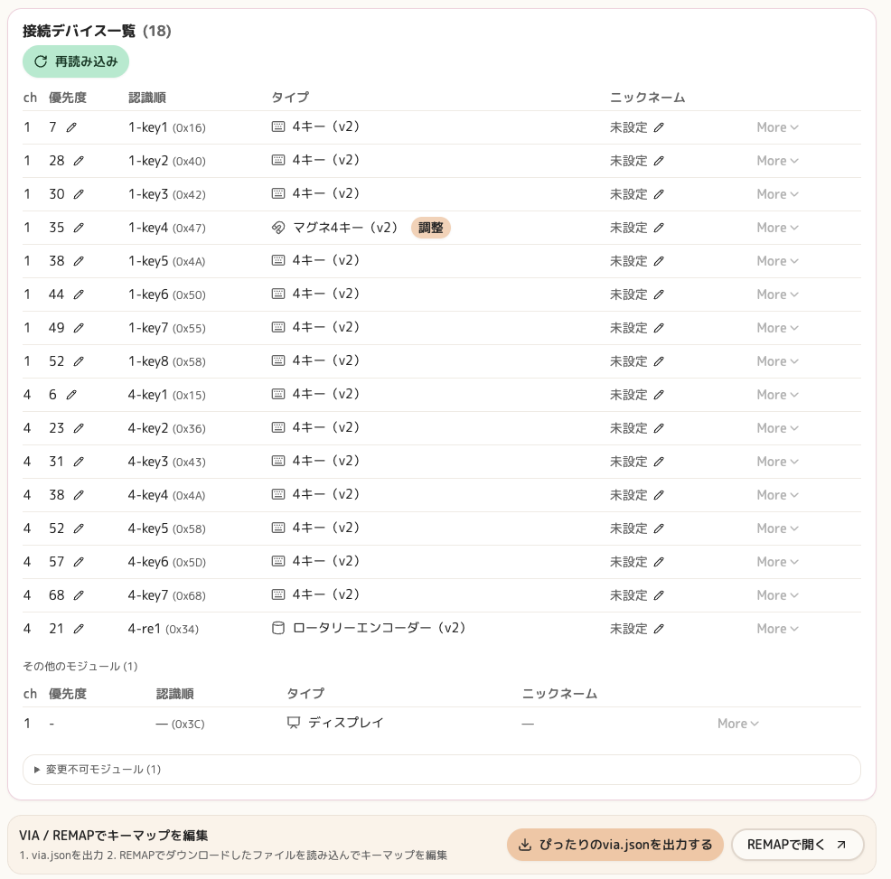

### Step3: モジュールの特定

モジュールが認識されることを確認したら、初期設定を行います。
接続されているモジュールは、物理的な位置と認識上の位置がバラバラになっており、どれがどのキーに対応するかはわからない状態になっています。
そのため、物理的な配置と合うように順番を設定してあげる必要があります。

まずは、どのモジュールがどう認識されているのかを特定しましょう。
ディスプレイモジュールをつないでいるかで作業の簡単さが変わります。

なお、特定したモジュールには、Webアプリの機能でニックネームを付けるのがおすすめです。
好きな名前で良いですが、分かりやすいように左から`左端`、`Q列`、`W列`、`...`のように、一般的なキーキャップの印字に従って付けるのがおすすめです。
なお、この別名はブラウザ側に保存されているため、別のPCやブラウザを使うとリセットされます。設定でエクスポートもできますので、適宜活用ください。

#### ディスプレイを利用する場合

Webアプリのメニューから「ディスプレイ」を選び、ディスプレイ表示を「入力デバイス表示」[^display-input-name]にします。
これは、最後に入力されたキーやノブの場所とアドレスを表示するものです。

[^display-input-name]: 名前は変更されているかもしれません。適宜読み直してください。

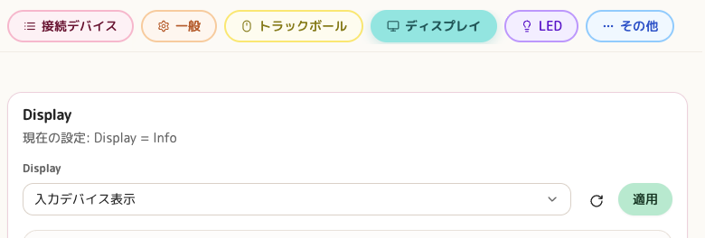

適用を押すと、ディスプレイの表示内容が変わります。

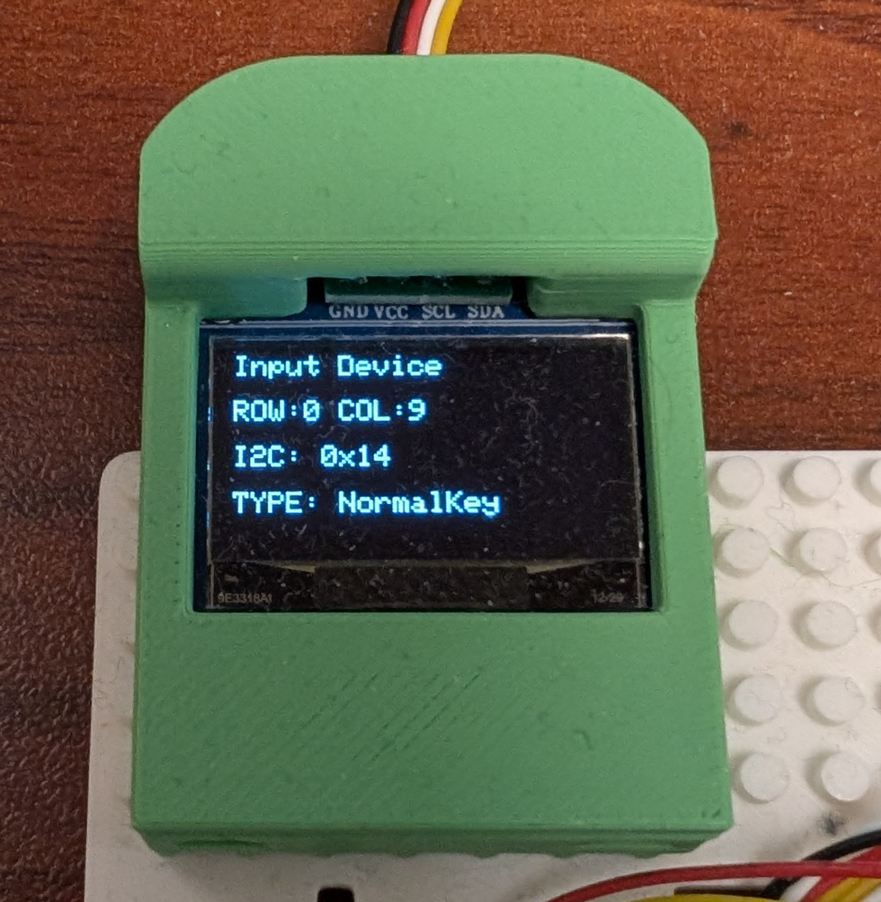

この状態で一つだけキーを押して表示が変わることを確認してください。
表示された`I2Cアドレス`とWeb App側のデバイス一覧表示を確認し、一致するものを探して特定します。

#### ディスプレイを利用しない場合

ディスプレイモジュールがない場合は、物理的に一つずつ抜き差しをして特定をします。

スターターセットなどで複数のモジュールがすでにつながっている場合は、一つずつ抜いて、どのアドレスがデバイス一覧から消えたかを記録します。特定できたものは別途メモしておきましょう。

### Step4: モジュールのアドレス設定

無事すべてのモジュールを特定できたらファームウェアから認識する順を変更します。アドレスが小さい順から左に並ぶようにすると分かりやすいです。
アドレスの変更もWebアプリから行います。

> [!IMPORTANT]
> 同じチャンネルで同じアドレスを設定すると、片方が消えたように見えます。
> こうなってしまうとそのままでは設定ができなくなります。
> 
> 競合しているモジュールのどちらかを外して、アドレスを変更した後、つなぎ直してください。

Webアプリのデバイス一覧では、「認識順」をクリックして編集ができます。
1から始まる番号を付けられるので、左端が1になるように変更してみましょう。
すでに1がある場合は一時的にそれを他のアドレスに変えて逃がします。
設定できる数字にはゆとりがあるので、隣接するモジュールでも3つ以上空けて設定するのがおすすめです。

> [!NOTE]
> 負荷が高い処理のため、稀に上手く処理が完了しない場合があります。
> 挙動が怪しい場合、ペンダントをPCから抜いて差し直し、再度確認してください。

物理的な順番と認識順が一致したら、次に進みます。

### Step5: モジュールの物理配置

次に、物理的な配置を整えましょう。

まずはキーキャップを装着します。
その後、土台の好きな位置にキーを移動し配置します。

> [!TIP]
> 土台製造の都合上、ばらつきが生じます。
> 硬くて嵌め込みにくい場合もありますが、完全に差し込めなくても固定できます。
> 使っていくうちに少しずつはめ込みやすくなることもありますので、しばらく様子見いただけますと幸いです。

キーモジュールを密着して配置させる場合、フレキケーブルを適切に折り曲げる必要があります。
あまり上部に伸びすぎるとキーキャップと干渉してしまうので、短くなるよう折り曲げるのがおすすめです。
キーモジュールのケースには切れ込みがあるので、そこを通して調整ください。

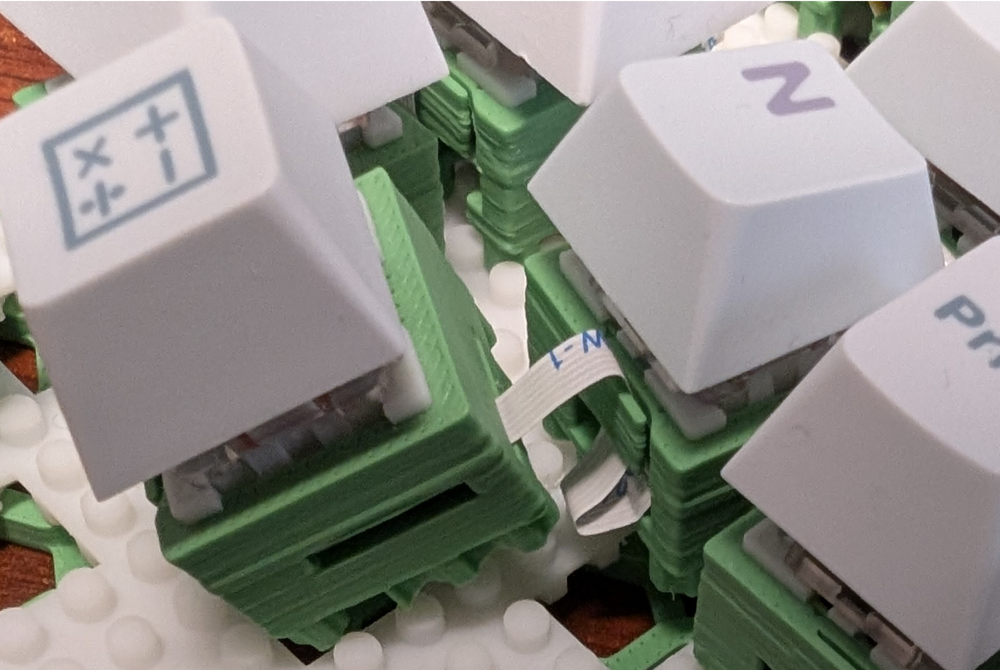

また、先頭キーからは4ピンのケーブルが伸びています。
これはケース底面のスリットを通したうえで、土台に配置をする必要があります。
細いので、土台と挟んで押し込んでしまうと切れてしまう場合もあるのでご注意ください。

4ピンケーブルは、土台の穴から通すことで、きれいにハブに接続ができます。
ただし組み替えは行いにくくなりますので、一旦上方向に伸ばしてハブに接続をし、配置が決まった後後半にあるガイドを参考にしてください。

うまく並べられたら次に進みます。
なお、移動中に力が加わり、ケーブルが接触不良になることがあります。
認識しているデバイス数を確認し、問題があれば[トラブルシューティングガイド](./troubleshoot.md)を参考に修正してください。

### Step6: キーマップの調整

最後にキーマップを変更します。Webアプリの接続デバイス一覧の下に`ぴったりのvia.jsonを出力する`というボタンがあります。
これを押すと、現在の構成に従ってキーマップを変更するためのファイルがダウンロードされます。

実際のキーマップの編集は、[REMAP](https://remap-keys.app)を利用します。VIAに対応しているものであれば他のアプリでも問題ありません。
このガイドでは、使いやすいREMAPで説明します。

キーボードを接続すると次のような画面が出ます。
ここでは、先ほどダウンロードしたvia.jsonを読み込ませます。

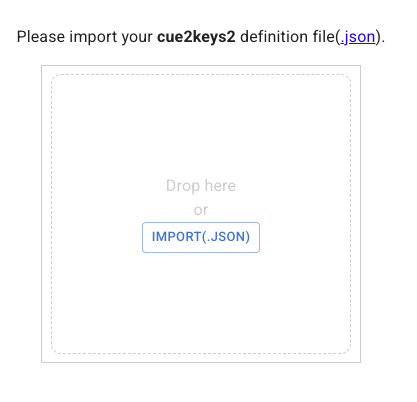

すると次のような画面が出てきます。実際の表示は、接続しているデバイスによって異なります。

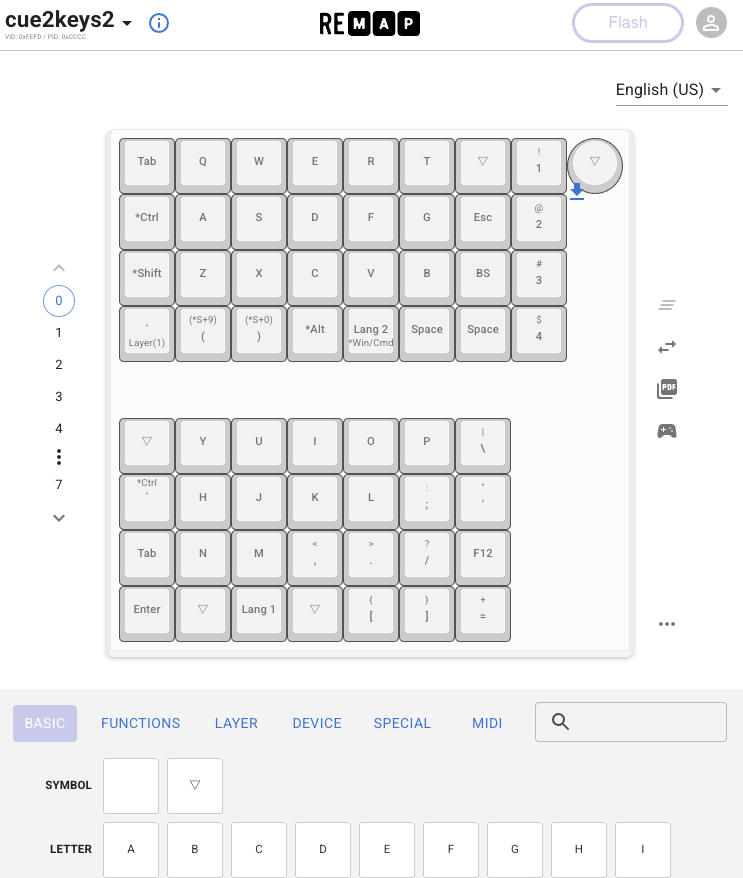

初期状態は構成にかかわらず標準のキーマップが設定されていますので、自由にキーマップを編集してください。
対応するキーの設定を変更し、右上のFlashを押すと更新できます。
設定したら実際に叩いて確認をしてみましょう。

ここで設定した内容は、ファームウェアの更新など、いくつかの理由でリセットされることがあります。REMAPには設定したキーマップを保存する機能もありますので、こまめな保存がおすすめです。

### Step7: モジュールの調整

くっつきー2では各種モジュールを細かく調整できます。
Webアプリから設定できるので、いろいろいじって試してみてください。

#### マグネキーの調整

ここでは試しにマグネキーのアクチュエーションポイント、リセットポイント、ラピッドトリガーの設定を変更してみましょう。

マグネキーを接続していると、接続デバイス一覧に調整ボタンが出ます。これをクリックすると、調整のためのフォームが表示されます。

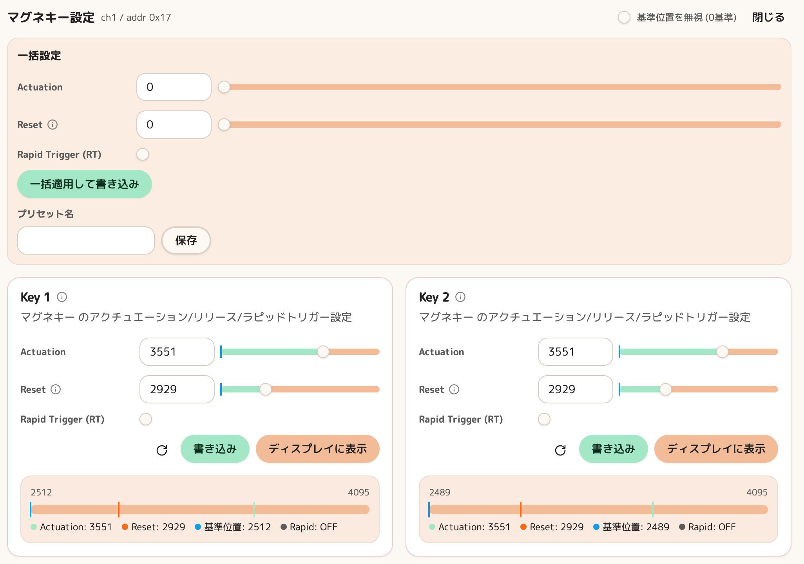

設定したいキーのカードにある`ディスプレイに表示`ボタンを押してみましょう。
するとディスプレイにそのキーが認識している値が出てきます。スイッチを押し込むとゲージが伸び、離すと戻ります。

ここで数値を確認しながらアクチュエーション、リセットの数値を変更し、書き込みをしてみましょう。
反応するポイントが変わっているはずです。

また、ラピッドトリガーのチェックボックスを入れると、リセットポイント値が意味合いが変わります。
最後に押し込んだ点からどれだけ離すとリセットされるかに変わりますので、こちらも色々な数値で試してみてください。

お気に入りの設定があれば`一括設定`を使って、そのモジュールにまとめて適用することもできます。

> [!NOTE]
> アクチュエーションポイントを`0`など、何もしていない時の数値より小さくしてしまうと、ずっと押し込まれた状態になります。
> 正しい値に修正してつなぎ直しましょう。

#### トラックボールの調整

トラックボールタブでは角度やポインターの移動速度などを設定できます。
こちらはUI通りなので、実際に動かしながら様々な値を試し、自分に合う値を見つけてみてください。

### Step8: 完成！そして調整へ

お疲れ様でした！

組み上がった形で自由にタイピングをしてみましょう。
実際に使ってみると、また調整したい部分が出てくるかと思います。

一通り試せたら、下記のガイドを参考にさらなる調整を試してみましょう。

## 変形のTIPS

一通りの動作確認ができたら、自分の望む形に変更してみましょう。

### まずは微調整から

親指部分のキー配置、縦列を列ごとずらす、オーソリニア配列を作ってみる、といった調整を試してみるのがおすすめです。

キースイッチ、ノブも変更できますので、お好きなものを試してみてください。

### 土台の滑り止め

土台には粒状の滑り止めが付属しています。

土台ケースがある場合は、底面の四隅に貼り付けやすいスペースがありますので、そこに貼り付けるのがおすすめです。
中心に少し高さが出て、しなりが生まれます。
これを嫌う場合は、シート上の滑り止めを別途用意し、中央に配置すると吸収できます。
もちろん、お気に入りの滑り止めがある場合は、付属のものを使わなくても問題ありません。

### ロウスタッガードの注意点

ロウスタッカード配置は、カラムスタッカードに比べ難易度が高い配置です。
ケーブルの柔軟性を使い、横並びと縦並びを組み合わせて目的の形を作ってみましょう。

また、キーのリマップも見た目と異なる形になります。慣れるまではややこしいので、カラムスタッガードで十分慣れてから操作をするのがおすすめです。

### キー数を減らす

配置によってはキー数が過剰になる場合があります。
その時は[キーモジュール詳細](./modules/keys.md)のページに従い、キー数を減らすことができます。

## ケーブル整理

ケーブル部分を整理する方法をまとめます。
形が変更しにくくなりますので、配置がある程度定まってから取り組むのがおすすめです。

### ケーブルの地下配置

ケーブルは土台と外ケースの間にある隙間を通すことができます。これにより、ケーブルが表に出ず、すっきり整理することができます。

まずは土台と外ケースを分離します。ゆっくりと四隅を押し出すように、少しずつ力を加えて外します。

外ケースの土台との接触部は、縦横にへこんでいるケーブルトンネルがあります。各モジュールは土台の穴を経由してこのトンネルを伝い、ハブに伸ばすことになります。

土台にモジュールを配置し、底面のスリットを通したりして、4pinケーブルを土台の穴から下に通します。
その後、うまく外ケースの凹みに合うようにケーブルを押さえつけます。マスキングテープなどで固定するのも良いでしょう。

その後、外ケースを取り付け直し、モジュールをハブに接続します。
移動中にケーブルが接触不良になることもありますので、動作確認をし、問題があればトラブルシューティングガイドを参考に修正してください。

### ハブケースの穴

ケーブルは、長さが余ってしまうと外に広がってしまいます。
その場合、ハブケースにある穴を使って整理することができます。

例えば、隣の穴と一周させて長さを消費したり、穴を通して反対側のコネクタに接続することで長さを調整できます。

構成に合わせてうまく設定してみましょう。

### 土台ケースのケーブル固定スリット

ハブを配置する箇所の手前に細いスリットが入った箇所があります。
ここにはケーブルを通して固定することができます。

一時的な作業のために固定するのも良いですし、長さが余っている場合、ここを使うことでケーブルが跳ね上がらないようにすることもできます。
