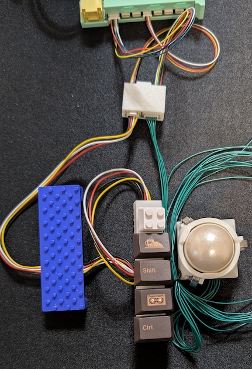

# 初代ユーザー向けガイド

初代くっつきーをご購入いただいた方のためのガイドです。

## 初代ユーザー特典

ご愛顧に感謝し、初代ユーザー特典を実施します。

- 期間: くっつきー2リリースから約半年間（3/28-9/29）
- 条件: 初代ペンダントの基板表裏の提示
- 対象製品: くっつきー2 スターターセット、各種モジュール。初代ユーザー向けモジュール（アップグレードキット）は既に値引きが入っているため対象外

イベントなど対面での購入では、初代ペンダント実物（または基板両面の写真）をお持ちいただくと10%の割引で購入いただけます。

boothでの購入の場合、購入直後にメッセージ機能で初代ペンダント基板表裏の写真をお送りください。購入価格の約10%のおまけを付けて送付します。

## アップグレード

初代のモジュールを活かしつつ、くっつきー2にアップグレードすることができます。
特に、2で新しく登場したマグネキーモジュールや25mmトラックボールを混在させたい場合に有用です。

ただし、くっつきー2ではケーブルの形状および処理方法を変更しており、初代くっつきーにくっつきー2のモジュールは利用できません。
また、くっつきー2から初代モジュールを使うためには変換モジュールが必要です。

1. くっつきー2の接続モジュールを揃える
   - ペンダントx1、ハブは必要数（両手分なので通常2つ）
2. 変換モジュールをハブの数だけ揃える
3. ビルドガイドに従い接続

変換モジュールは、初代ケーブルの4pin/6pinが接続できる側、くっつきー2の4pin/6pinケーブルが接続できる側があります。

初代側では4pinケーブルでハブと接続し、6pinケーブルで初代トラックボールを接続します。
2側では、4pinケーブルと6pinケーブルをハブに接続します。
この機、初代トラックボールを接続しない場合は、6pinケーブルを繋ぐ必要はありません。

中央の白い箱で示されるのが変換モジュールです。
接続した先のくっつきー2のハブでは、2のモジュールが利用できます。

変換モジュールには必要なケーブルが付属します。

- 初代4pinケーブル
- 2の4pinケーブル
- 2の6pinケーブル

### アップグレードキット

初代スターターセットをお持ちの方に向けて、必要なモジュールをセットにしたお得なキットを販売します。

- ペンダント
- ハブx2
- 変換モジュールx2
- ディスプレイ

くっつきー2ではペンダントとディスプレイが分離しているので、ディスプレイモジュールも付けています。
このキットに加え、使いたいくっつきー2のモジュールをお求めいただくことでスムーズに移行できます。
