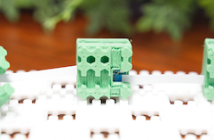

# キーモジュール詳解

https://c2k.booth.pm/items/8027041

## キースイッチの変更

一般的なキースイッチプーラーなどを使い、スイッチを取り外して変更してください。

通常キーモジュールは、5pinまたは3pinのCherry MXキースイッチに対応しています。
また、マグネキーモジュールは、KS-20互換であれば動作します。他のキースイッチでも形状が合えば設定で対応できると思いますが、公式サポートにはなりません。小数のキーで試してから入れ替えをお勧めします。

## 分解・組み立て

### 必要な状況

- キー数を減らしたい（最小2キー、最大4キーで動作します）
- トラブルシューティング・メンテナンス

## 手順

キーモジュールのケースを変えたい場合やケーブルの接続を変更したい場合、キーの数を変えたい場合はこの手順に従ってください。

キーモジュールは小さいパーツが多く、分解・組み立てには注意が必要です。時間もかかるため、余裕のあるときに行いましょう。

### 用意するもの

- なるべく細いマイナスドライバー

### 分解方法

各キーを接続しているFPCケーブルを外します。

FPCケーブルはFPCコネクターで留められています。
青色のストッパーを上げてケーブルを引き抜くことで外せます。
ケースの背面にある隙間から、マイナスドライバーを使って外してください。

ケーブルが外せたら、基板をスライドして取り出します。
通常キーモジュールではキーソケットで固定されているので、上方向に押し上げる必要があります。

3,4キーは外しても動作しますが、1,2キーは動作に必須です。

### 組み立て

分解と逆の手順を行います。

まずは基板をケースに格納します。
特にマグネキーでは、向きを間違えないようにしてください。

FPCケーブルは、ケースの裏側から見て青色の部分が上に来るようにして接続をすると楽です。両端を同じ方向で留める必要があります。

2,3,4キーに関しては、スリットを通して前のキーからFPCケーブルを通し、内部でコネクタに差し込む必要があります。
この作業は手先の器用さが問われます。
なるべく細いマイナスドライバーを使い、誘導したうえで青色のカバー部分を押し込み、ストッパーを下ろすとやりやすいです。
青色の部分は厚みがあり硬いので、そこをマイナスドライバーで押してコネクタの奥に差し込みます。十分に差し込まれたと思ったら、青色のストッパーを下げて固定します。

1キーは、4pinSHケーブルを繋いでから基板をケースに格納します。

> [!TIP]
> ストッパーを上げてからケースに入れると楽です。
> 
> スリットを通す必要があるケーブルを先につないでおくと楽です。
> 4キーから順番に作っていくとスムーズに進みやすいです。
