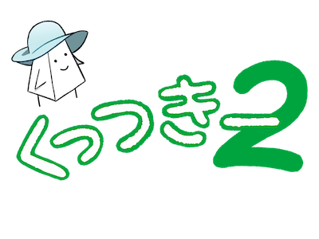
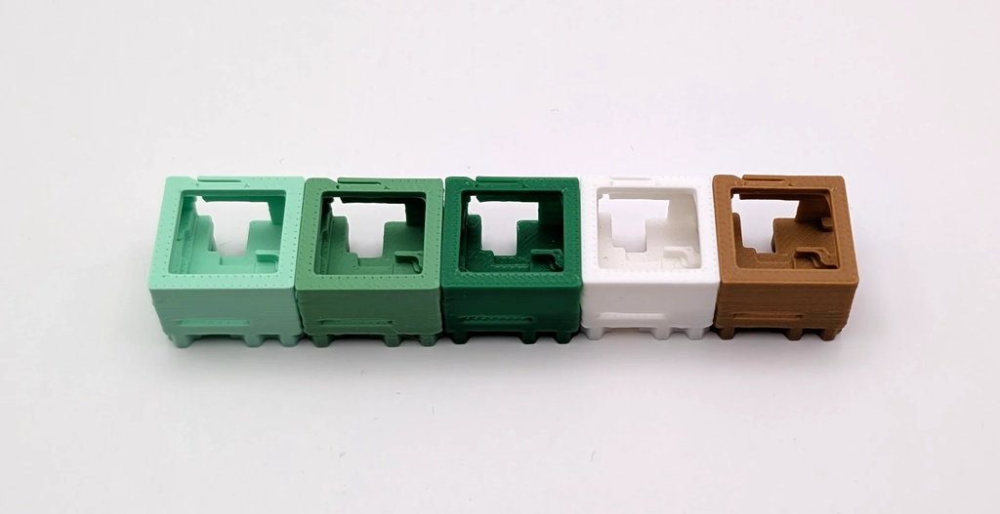

# くっつきー2 購入ガイド

くっつきー2の世界へようこそ！

このドキュメントはくっつきー2の購入ガイドです。

## 概要

くっつきー2はフルモジュラー式のキーボードです。
各パーツはモジュールとなり、好きな数、位置に配置することができます。

特徴の詳細は、下記の記事をご覧ください。

https://www.esplo.net/ja/posts/2026/02/cue2keys2

下記のページにリンクをまとめています。

https://www.esplo.net/ja/products/cue2keys2

最新情報はSNSをご覧ください。

https://x.com/cue2keys

## V2で対応しているモジュール

- [キーモジュール](https://c2k.booth.pm/items/8027041)（最大4キー、メカニカルスイッチ）
- [マグネキーモジュール](https://c2k.booth.pm/items/8027041)（最大4キー、磁気スイッチ）
- [ロータリーエンコーダー（ノブ）](https://c2k.booth.pm/items/8092543)
- [トラックボール](https://c2k.booth.pm/items/8090670)
- [ディスプレイ](https://c2k.booth.pm/items/8105221)

### 接続用モジュール

- [ハブ](https://c2k.booth.pm/items/8092567)
- [ペンダント](https://c2k.booth.pm/items/8092877)
- [土台](https://c2k.booth.pm/items/8092741)
- [土台ケース](https://c2k.booth.pm/items/8092741)

### 初代の互換モジュール

初代くっつきーをお持ちの方は、初代の下記モジュールもつなぐことができます。

- 4キーモジュール
- 5キーモジュール
- 初代ロータリーエンコーダー
- 初代トラックボール

ただし、ケーブルが異なるため変換モジュールが必要です。
それぞれのモジュールの詳細はリンク先をご覧ください。

## 購入ガイド

「この構成で動くの？」

悩んだら、[制約ガイド](./limits.md)などを参照しつつ、お気軽にSNSなどでご相談ください。

### 迷ったら？

おすすめはスターターセットです。

動作に必要なモジュール一式が揃い、56キーの左右分割キーボードが組み立てられます。
DXセットでは、追加で磁気キースイッチ対応モジュール4キー分、トラックボール、ノブ、ディスプレイが付属します。

スターターセットには、さらにキーやノブを追加することができます。また、スターターセットの一部を使ってテンキーを作成するといったこともできます。

https://c2k.booth.pm/items/7753347

### 最小限で組んでみたい

最低限動作に必要なものは、ペンダントとハブです。
これにキーモジュールやノブ、トラックボールを付けることで動作します。
左右で分割をしたい場合は、ハブを2つにします。

別途固定する方法が必要です。無い場合は土台をを追加し、その上に配置をしてください。

これらを踏まえ、例えばテンキー（全16キー）を土台付きで作成すると、次のような構成になります。

- ペンダントx1
- ハブx1
- キーモジュールx4
- 土台x1

### 片手デバイスとして使いたい

クリエイティブ用途に片手デバイスとして使うことも可能です。
例えば次のような構成で作成できます。

- ペンダントx1
- ハブx1
- キーモジュールx2
- ノブx4
- トラックボールx1
- 土台x1

位置を自由に変更できるので、手に合う形にして生産性を上げましょう。

## オンライン販売について

キーケット終了後、予約販売を開始します。
本作は製造に時間がかかるので、セットは注文いただいてからお時間がかかることをご了承ください。

直近のスケジュールとしては、下記の通りです。

- 4月: 予約受け付け（7月発送分）
- 5-6月: 予約受け付け（4月受け付け分以降の発送）
- 7月: 順次発送開始、在庫追加

予約受け付けでおおよその数を見積もり、発注します。
少し多めに発注をするので、予約分から順次発送し、余れば在庫として追加いたします。

### 色について

基本、[ショップページ](https://c2k.booth.pm/items/7753347)に記載のある通り「わかば（明るい緑色、画像の左端）」で統一する予定です。
ただ、長い期間お待たせしてしまうので、ご希望に応じて「わかば」と「くも（白、右から2番目）」との組み合わせも可能とします [^color_change]。

詳細が決まり次第、予約購入後のメッセージ機能にてご連絡いたしますので、ご確認ください。

[^color_change]: おそらく問題ないかと思いますが、製造都合により色が変わる可能性があることもご了承ください（実際、左から2番目の色は商品写真撮影後にフィラメントが終売となってしまいました……）

### 予約後の各種変更について

仕様変更などがあれば、適宜お知らせをします。
ご購入者様側で選択が必要な場合は、ブースのメッセージ機能でご連絡いたします。

### その他

最新情報・詳細はSNSをご覧ください。

https://x.com/cue2keys

基本点があればお気軽にご連絡ください。
よくあるご質問は、本ドキュメントに追記します。
